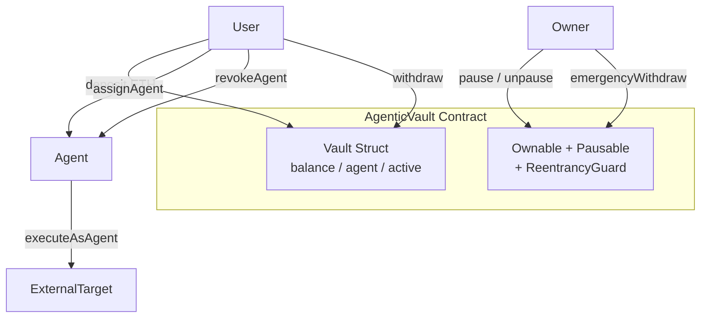
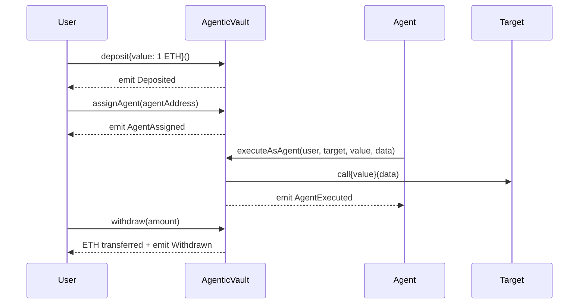
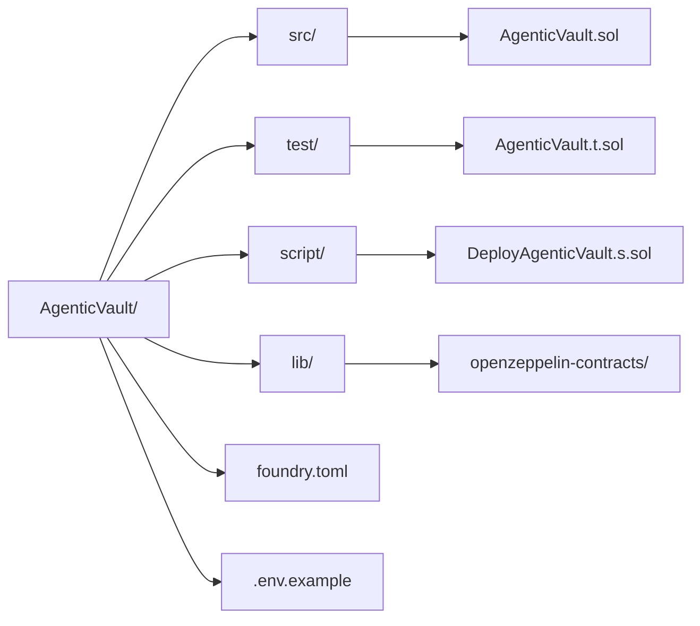

# AgenticVault


A production-ready agentic execution vault on Ethereum and Base. Users deposit ETH into isolated vaults, assign AI agent addresses to execute on-chain actions on their behalf, and retain full control to revoke access at any time. Built with security-first patterns, full OpenZeppelin integration, and a comprehensive Foundry test suite.

---

## Table of Contents

- [Overview](#overview)
- [Architecture](#architecture)
- [Contract Details](#contract-details)
- [Deployments](#deployments)
- [Getting Started](#getting-started)
- [Project Structure](#project-structure)
- [Core Concepts](#core-concepts)
- [Security Model](#security-model)
- [Events and Errors](#events-and-errors)
- [Testing](#testing)
- [Deployment](#deployment)
- [Gas Optimization](#gas-optimization)
- [Contributing](#contributing)
- [License](#license)

---

## Overview

AgenticVault is a non-custodial smart contract vault designed for agentic AI workflows. Each user controls an isolated vault. An assigned agent — typically an AI-controlled address — can execute arbitrary on-chain calls funded from the vault balance. The user always retains the ability to revoke the agent, withdraw funds, and resume control at any time.

The contract is fully pausable by the owner for emergency situations, and all ETH recovery paths are protected by reentrancy guards and the checks-effects-interactions pattern.

---

## Architecture





---

## Contract Details

| Property | Value |
|---|---|
| Language | Solidity `^0.8.24` |
| OpenZeppelin | v5.0.2 |
| Inheritance | `Ownable`, `Pausable`, `ReentrancyGuard` |
| Error Handling | Custom errors only |
| Patterns | Checks-Effects-Interactions, Pull-payment |
| Networks | Ethereum, Base (no chain-specific logic) |
| Optimizer | Enabled, 200 runs |

### Vault Struct

```solidity
struct Vault {
    uint256 balance;  // slot 0
    address agent;    // slot 1 — packed with active (20 + 1 bytes)
    bool active;      // slot 1 — packed
}
```

Storage slots are packed to minimize gas on reads and writes. The `agent` address and `active` boolean share a single 32-byte slot.

---

## Deployments

| Network | Contract Address | Explorer |
|---|---|---|
| Base Mainnet | `0xb8c3A6Aa148D4E5cB978A1bf249BC838CE0832E9` | [Basescan](https://basescan.org/address/0xb8c3A6Aa148D4E5cB978A1bf249BC838CE0832E9) |
| Base Sepolia | `0x7b682e166589b723062a87b32bd353969fd11753` | [Base Sepolia Scan](https://sepolia.basescan.org/address/0x7b682e166589b723062a87b32bd353969fd11753) |

---

## Getting Started

### Prerequisites

- [Foundry](https://book.getfoundry.sh/getting-started/installation)
- Git

### Installation

```bash
# Clone the repository
git clone https://github.com/your-org/AgenticVault
cd AgenticVault

# Install OpenZeppelin as a git submodule
forge install OpenZeppelin/openzeppelin-contracts@v5.0.2 --no-commit

# Verify installation
forge build
```

### Environment Setup

```bash
cp .env.example .env
```

Edit `.env` with your values:

```bash
PRIVATE_KEY=your_private_key_here
RPC_URL_SEPOLIA=https://sepolia.infura.io/v3/YOUR_KEY
RPC_URL_BASE=https://mainnet.base.org
ETHERSCAN_API_KEY=your_key
BASESCAN_API_KEY=your_key
```

---

## Project Structure



```
AgenticVault/
├── src/
│   └── AgenticVault.sol              # Main contract
├── test/
│   └── AgenticVault.t.sol            # Unit + fuzz test suite
├── script/
│   └── DeployAgenticVault.s.sol      # Deployment script
├── lib/
│   └── openzeppelin-contracts/       # OZ v5.0.2 via git submodule
├── foundry.toml                      # Foundry config
├── .gitmodules                       # Submodule declarations
├── .env.example                      # Environment variable template
└── README.md
```

---

## Core Concepts

### Vault Isolation

Every user address maps to its own independent `Vault` struct. No user can read, write, or withdraw from another user's vault. The contract enforces this at the storage level — there are no shared balance pools.

### Agent Execution

An agent is an address the vault owner authorizes to call `executeAsAgent`. This is designed for AI agents or automation bots that need to transact on-chain using funds the user has pre-allocated. The agent has no ability to reassign itself, change the vault configuration, or access any vault other than the one it was assigned to.

```
User assigns Agent  ->  Agent calls executeAsAgent(user, target, value, data)
                    ->  Vault deducts balance (CEI pattern)
                    ->  Low-level call dispatched to target
                    ->  Reverts fully if call fails (balance restored)
```

### Pull Payment

Withdrawals use the pull pattern. The contract deducts the balance before transferring ETH, preventing reentrancy and ensuring the accounting is always consistent even if the transfer fails.

### Emergency Controls

The contract owner can pause all state-changing operations (deposit, withdraw, assignAgent, executeAsAgent) via `pause()`. The `revokeAgent()` function intentionally remains available while paused so users can always protect themselves. `emergencyWithdraw()` allows the owner to recover ETH from the contract in a crisis.

---

## Security Model

### Patterns Implemented

| Pattern | Applied To |
|---|---|
| Checks-Effects-Interactions | `withdraw`, `executeAsAgent`, `emergencyWithdraw` |
| ReentrancyGuard | `withdraw`, `executeAsAgent`, `emergencyWithdraw` |
| Pull Payment | `withdraw` |
| Pausable | All user-facing state changes |
| Role-gated Access | Owner functions via `Ownable` |

### What the Agent Cannot Do

- Access any vault other than its assigned user's vault
- Re-assign itself or change the agent address
- Withdraw directly — it can only `executeAsAgent` up to the vault balance
- Operate while the contract is paused
- Operate after the user has called `revokeAgent`

### What the Owner Cannot Do

- Access individual user vault balances directly (only `emergencyWithdraw` drains the whole contract, reserved for emergencies)
- Modify agent assignments or vault states
- Execute calls on behalf of users

### Known Considerations

- `executeAsAgent` dispatches arbitrary low-level calls. Users are responsible for trusting the agent they assign.
- `emergencyWithdraw` does not credit individual vault balances back — it is a last-resort recovery mechanism.
- The contract does not implement upgradability. Deployments are immutable.

---

## Events and Errors

### Events

```solidity
event Deposited(address indexed user, uint256 amount);
event Withdrawn(address indexed user, uint256 amount);
event AgentAssigned(address indexed user, address agent);
event AgentRevoked(address indexed user);
event AgentExecuted(address indexed user, address agent, address target, uint256 value);
event EmergencyWithdraw(address indexed owner, uint256 amount);
```

### Custom Errors

```solidity
error NotVaultOwner();          // Caller is not the vault owner
error VaultNotActive();         // Vault has never received a deposit
error AgentNotAssigned();       // No agent set for this vault
error ZeroAddress();            // Address(0) passed where disallowed
error InsufficientBalance();    // Amount exceeds vault balance or is zero
error ExecutionFailed();        // Low-level call returned false
error Unauthorized();           // Caller is not the assigned agent
```

---

## Testing

The test suite uses Foundry and covers unit tests, edge cases, access control, reentrancy, and fuzz testing.

### Run All Tests

```bash
forge test -vvv
```

### Run with Gas Report

```bash
forge test --gas-report
```

### Run Coverage

```bash
forge coverage
```

### Run Fuzz Tests Only

```bash
forge test --match-test testFuzz -vvv
```

### Test Categories

| Category | Tests |
|---|---|
| Deposit | Success, zero value, multiple deposits, via `receive()`, paused |
| Agent Management | Assign, zero address revert, revoke, revoke while paused |
| Withdraw | Success, partial, zero, excess, vault not active, paused, isolation |
| Agent Execution | Success, wrong agent, no agent, vault inactive, insufficient balance, zero target, failed call, after revoke, paused |
| Pause / Unpause | Only owner, cycle, operations blocked and unblocked |
| Emergency Withdraw | Success, zero balance, only owner |
| Reentrancy | Withdraw protected via malicious contract |
| Fallback | Reverts on calldata |
| Fuzz | Deposit amounts, partial withdrawals, vault isolation across users |

---

## Deployment

### Local (Anvil)

```bash
# Terminal 1 — start local node
anvil

# Terminal 2 — deploy
forge script script/DeployAgenticVault.s.sol \
  --rpc-url http://127.0.0.1:8545 \
  --private-key 0xac0974bec39a17e36ba4a6b4d238ff944bacb478cbed5efcae784d7bf4f2ff80 \
  --broadcast -vvvv
```

### Sepolia Testnet

```bash
source .env
forge script script/DeployAgenticVault.s.sol \
  --rpc-url $RPC_URL_SEPOLIA \
  --private-key $PRIVATE_KEY \
  --broadcast \
  --verify \
  --etherscan-api-key $ETHERSCAN_API_KEY \
  -vvvv
```

### Base Mainnet

```bash
source .env
forge script script/DeployAgenticVault.s.sol \
  --rpc-url $RPC_URL_BASE \
  --private-key $PRIVATE_KEY \
  --broadcast \
  --verify \
  --etherscan-api-key $BASESCAN_API_KEY \
  -vvvv
```

---

## Gas Optimization

| Optimization | Detail |
|---|---|
| Struct packing | `agent` and `active` share a single storage slot |
| Custom errors | No string literals in reverts — saves deploy and runtime gas |
| `calldata` parameters | `bytes calldata data` in `executeAsAgent` avoids memory copy |
| Early revert | Checks ordered cheapest-first before storage reads |
| Optimizer | 200 runs — balanced for deployment cost and runtime efficiency |

---

## Contributing

1. Fork the repository
2. Create a feature branch: `git checkout -b feat/your-feature`
3. Write tests for any new functionality
4. Ensure `forge test` passes with no failures
5. Submit a pull request with a clear description of changes

All pull requests must maintain or improve test coverage and must not introduce `require` strings — use custom errors exclusively.

---

## License

MIT — see [LICENSE](./LICENSE) for details.
